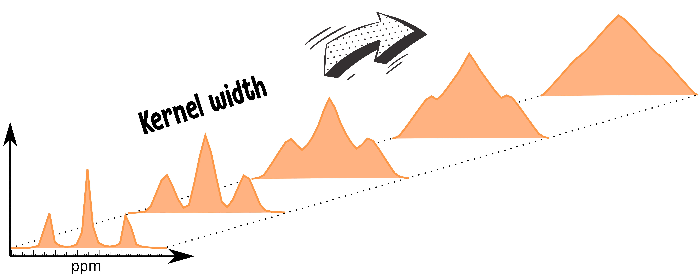

# integral-transforms

[![NPM version][npm-image]][npm-url]
[![build status][ci-image]][ci-url]
[![Test coverage][codecov-image]][codecov-url]
[![npm download][download-image]][download-url]

<p align="center">
  
</p>
<p align="center">
  A tool for line broadening through integral transforms.
</p>

## Installation

`$ npm i integral-transforms`

## Usage

```js
import { getbroadenedSpectrum } from 'integral-transforms';

const signal = [0, 0.1, 0.2, 0.3, 0.4, 0.5, 0.4, 0.3, 0.2, 0.1, 0];

const broadedSignal = getbroadenedSpectrum(signal, { kernelWidth: 7 });
// [0.04, 0.12, 0.24, 0.53, 0.80, 1, 0.80, 0.53, 0.24, 0.12,0.04]
```

**Arguments**

* `array`: Matrix containing the inputs.

**Options**

* `shape`: Define the shape of the kernel (default: 'triangular').
* `kernelWidth`: Set up the length of the kernel to perform the convolution (default: 7).

**Shapes**

* Triangular
* Gaussian
* Lorentzian

## License

[MIT](./LICENSE)

[npm-image]: https://img.shields.io/npm/v/integral-transforms.svg
[npm-url]: https://www.npmjs.com/package/integral-transforms
[ci-image]: https://github.com/josoriom/integral-transforms/workflows/Node.js%20CI/badge.svg?branch=master
[ci-url]: https://github.com/josoriom/integral-transforms/actions?query=workflow%3A%22Node.js+CI%22
[codecov-image]: https://img.shields.io/codecov/c/github/josoriom/integral-transforms.svg
[codecov-url]: https://codecov.io/gh/josoriom/integral-transforms
[download-image]: https://img.shields.io/npm/dm/integral-transforms.svg
[download-url]: https://www.npmjs.com/package/integral-transforms